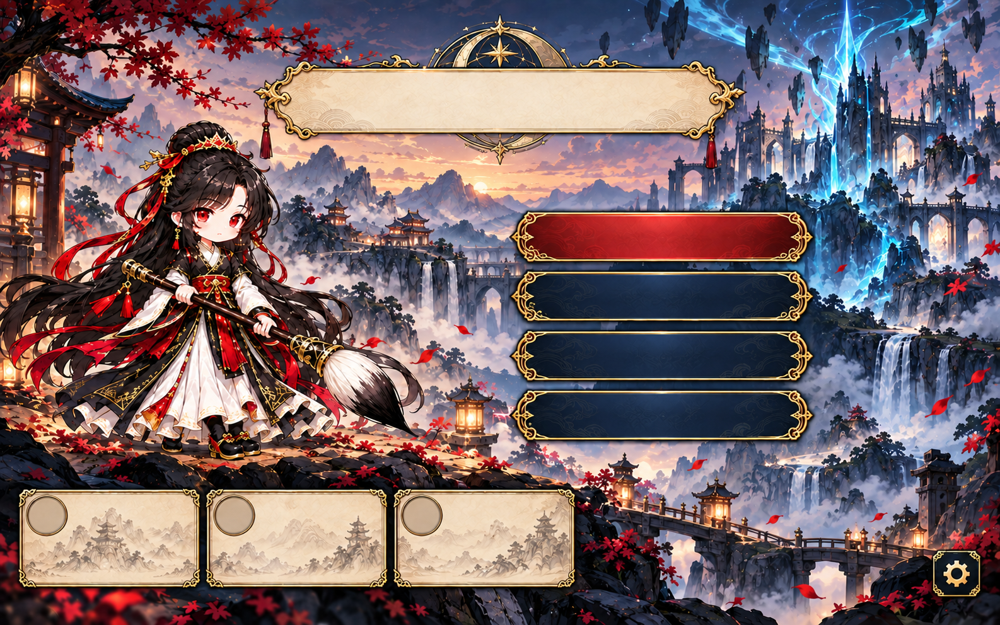
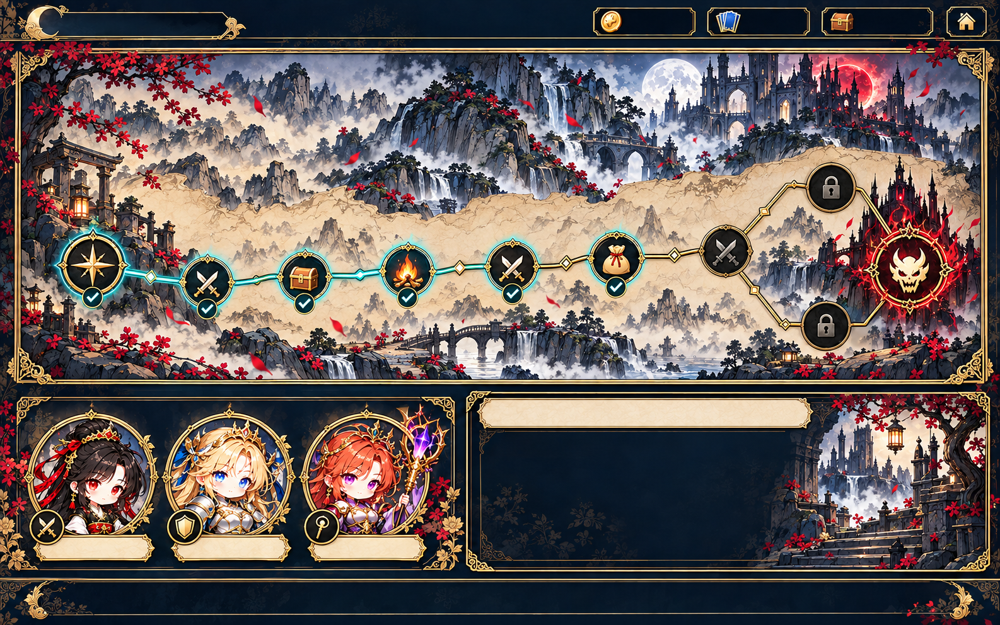
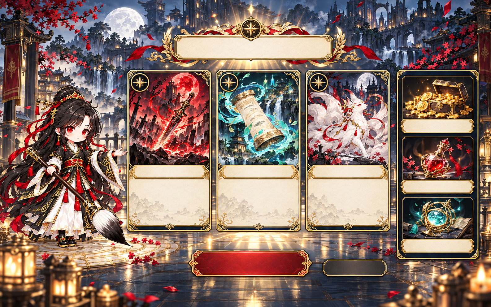
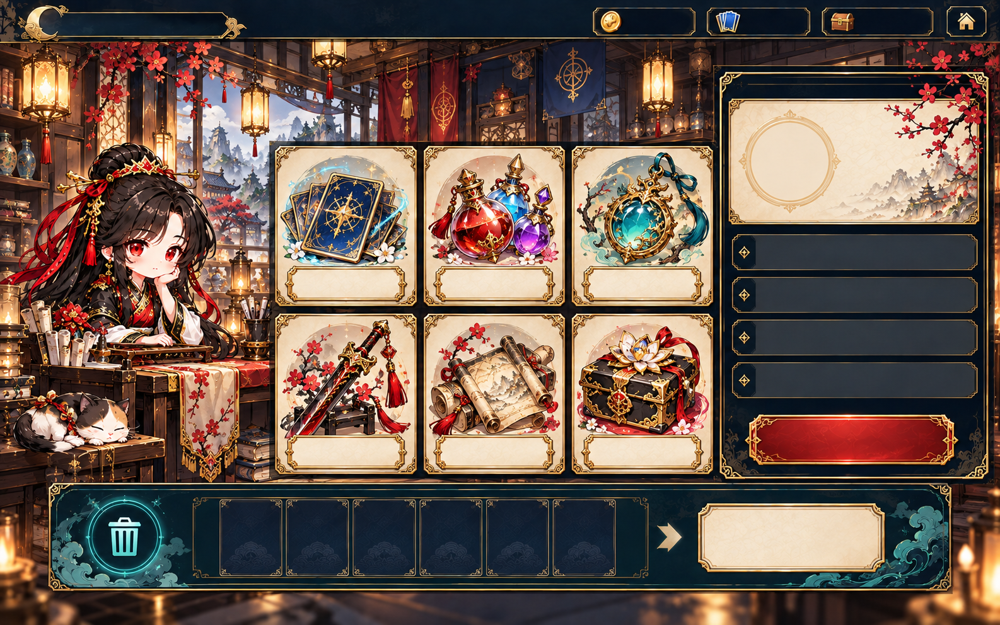
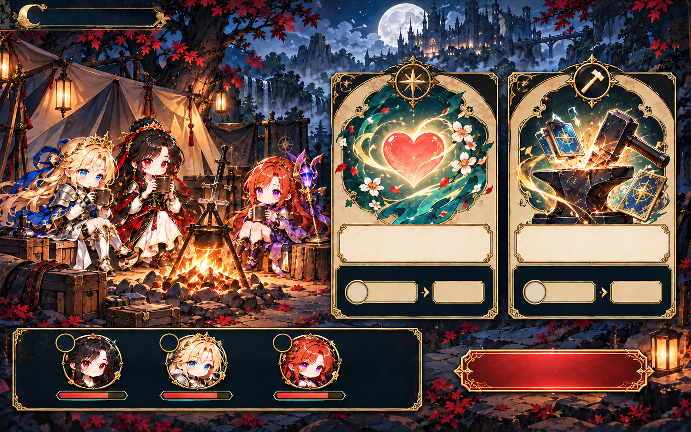
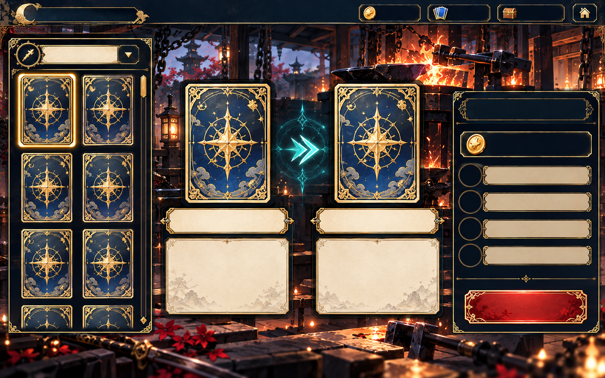
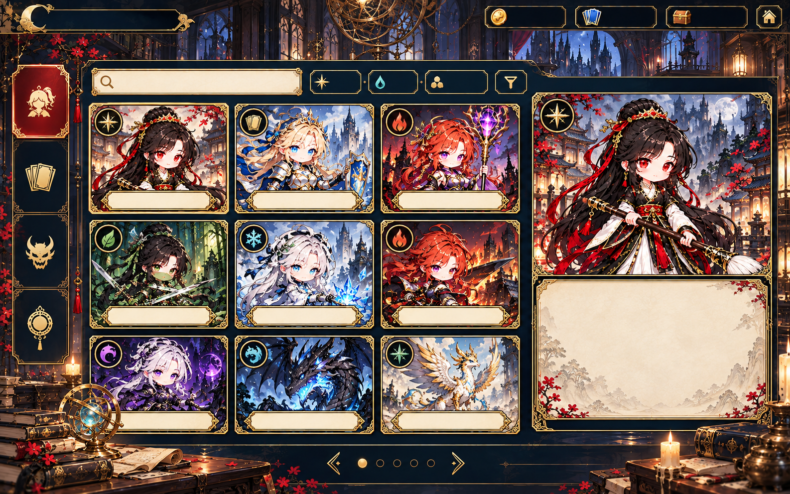
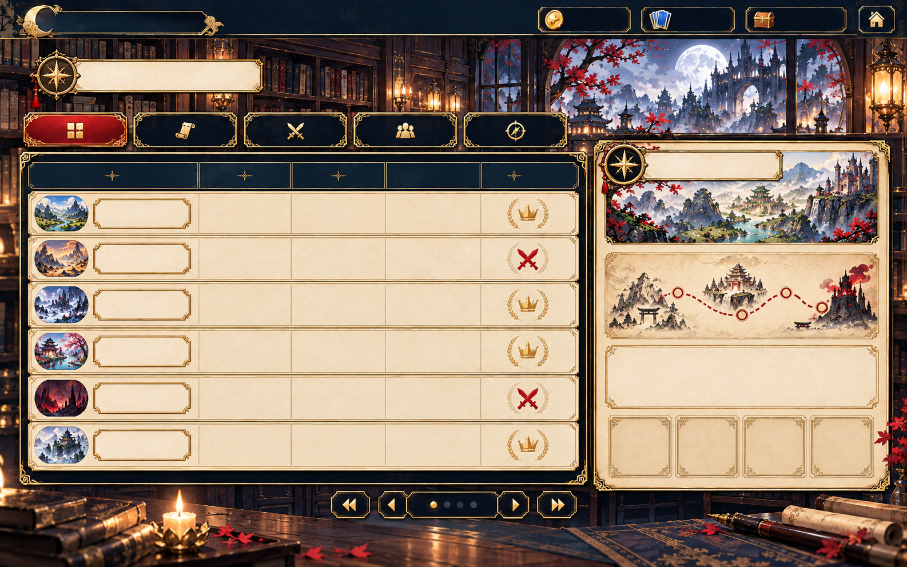
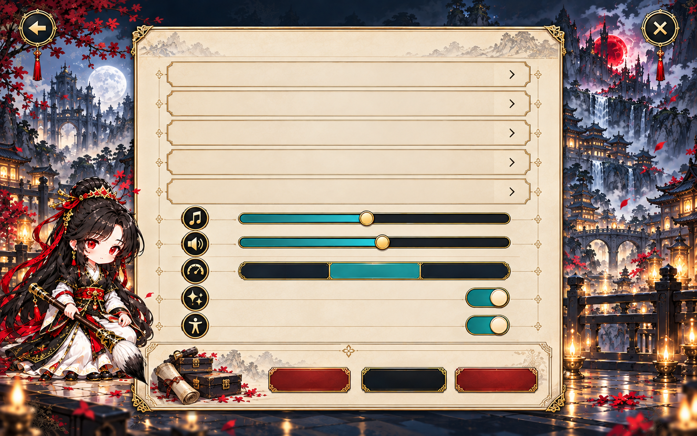

# 추가 SD UI 화면 시안

2026-10-04 · 초기 로비·전투·편성·월드맵 승인 방향을 확장한 9장

전체 화면은 배치 참고용 불투명 PNG다. 화면 속 글자와 숫자는 비워 두었으며 실제 문구·수치·항목은 기존 게임 데이터로 표시한다. 기능·정보 구조는 [DESIGN_HANDOFF.md](DESIGN_HANDOFF.md), 개별 파일 크기·투명 여부는 [DESIGN_ASSET_CATALOG.md](DESIGN_ASSET_CATALOG.md)를 따른다. 기존 4장은 [UI_REDESIGN_PROPOSAL.md](UI_REDESIGN_PROPOSAL.md)에 있다.

## 타이틀

## 던전 지도

## 보상

## 상점

## 휴식

## 대장간

대형 카드 전후 영역은 시안에서 카드 뒷면으로 비워 두었다. 실제 연결에서는 선택 카드 앞면과 강화 전후의 전체 효과를 보여 준다.

## 도감

여러 종류의 항목이 섞인 것은 목록 구조 예시다. 실제 분류 탭에서는 동료·카드·몬스터·유물을 나누고 승인된 외형을 사용한다.

## 기록

## 설정

