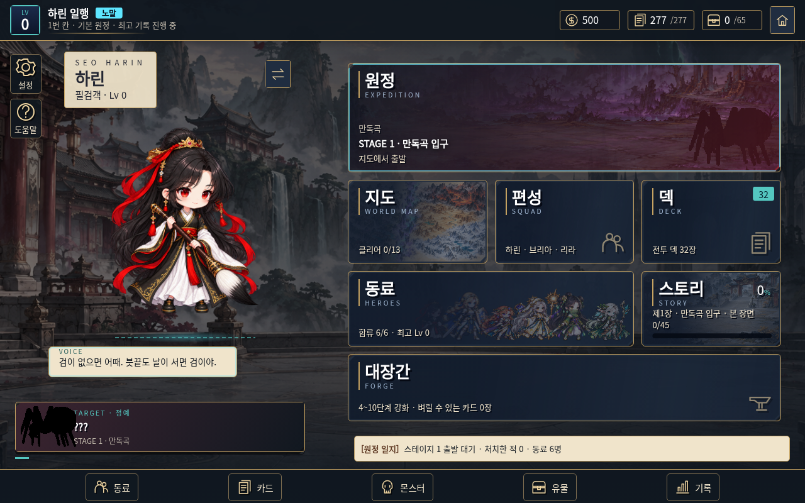
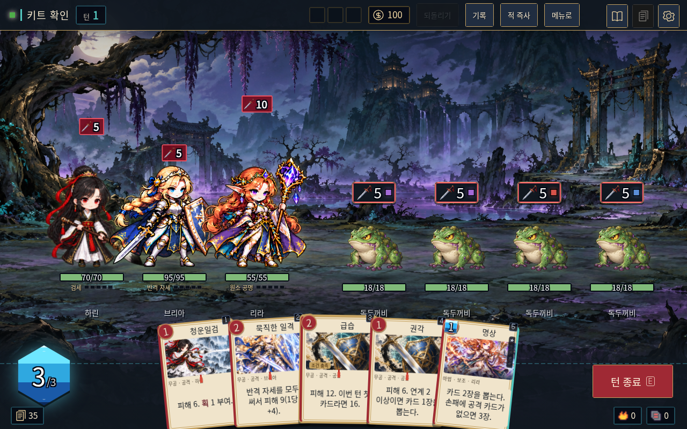

# UI 키트 검수 기록

2026-10-04 · `docs/ui-kit/` 전달물 검수. 게임 본체 파일은 수정하지 않았다.

## 독립 키트

- 로컬 HTTP에서 부품·로비·전투·편성·시스템 페이지를 실행했다. 이미지 로딩 실패 0건, JavaScript 오류 0건, 외부 요청 0건이었다.
- 긴 카드 효과 상세 창, Esc 닫기와 포커스 복귀, 동료 선택/해제와 샘플 3명 제한, 도감 검색, 설정 스위치를 확인했다. 움직임 감소 설정에서는 전환 시간이 0초였다.
- 1280px에서 다섯 페이지를 시각 검수했다. 1024·1440·390px에서 로비·전투·편성·시스템의 문서 폭은 뷰포트 폭과 같았다. 손패와 표 내부의 가로 스크롤은 허용한다. 390px는 키트의 참고 배치이며 실제 게임 모바일 지원을 검증한 것은 아니다.
- 정의된 단색 조합의 대비: 한지/먹색 14.18:1, 주요 버튼 글자/붉은 표면 6.78:1, 보조 글자/패널 7.30:1. 배경 그림과 합성되는 모든 실제 게임 영역의 대비를 보장하는 수치는 아니다.
- `node --check docs/ui-kit/preview.js`, JSON 파싱, CSS 이미지 경로 존재 검사를 통과했다.

## 현재 게임용 선택형 스킨

현재 게임을 새 브라우저 컨텍스트에서 열고 `game-skin.css`와 body 클래스를 **브라우저에만 임시 주입**했다. 로비·편성·전투를 확인했으며 소스 HTML은 바꾸지 않았다.

- 동료 선택/해제, 전투 기록 열기/닫기 정상.
- 동료 3명·적 4마리 전투에서 손패 5장의 가로 제목, 14px 효과 글자, 소유자/조건/연계/툴팁 정보 유지.
- 스킨 적용 전후 카드 데이터 동일. 실행 오류 0건.
- 1024·1440px에서 앱 폭과 뷰포트 폭 동일.
- 기존 게임의 외부 글꼴 요청 2건은 검수 환경에서 차단했고 로컬 글꼴을 사용했다. 독립 키트에는 외부 요청이 없다.

아래는 임시 스킨의 실제 게임 캡처다. 게임에 이미 적용되었다는 의미는 아니다.

## 리소스와 한계

`node tools/sync-assets.js --check`는 리소스 42개, 오류 0건으로 통과했다. 기존 이미지 해상도 관련 경고 27건은 남아 있다. 이번 작업은 기존 PNG를 변경하지 않았으며 새 제작 PNG도 없다. 새 이미지 생성은 도구 사용 한도에 막혔고 카드 틀/패널/보석은 CSS 부품으로 제공했다.

이 환경의 브라우저 정책이 `file://` 탐색을 `ERR_BLOCKED_BY_ADMINISTRATOR`로 차단해 직접 파일 실행을 검증하지 못했다. 검수는 localhost HTTP에서 수행했다. 키트는 로컬 파일과 일반 script/CSS만 사용하지만 Claude가 연결 후 실제 로컬 파일 실행을 확인해야 한다.

전체 13개 화면의 재배치, 카드 드래그/조준/사용, 저장 호환성, 캠페인 진행, 모든 키보드 조작과 대체 이미지 경로의 게임 통합 검사는 Claude 적용 후 수행한다. 이번 검수는 전체 게임 회귀 검사를 대신하지 않는다.

## 게임 연결 검수 (Claude, 2026-10-04)

키트를 게임에 연결한 뒤 `file://index.html`을 Chromium(Playwright)으로 직접 열어 확인했다(이 환경에서는 file:// 실행이 된다).

- 연결: `index.html`이 `docs/ui-kit/ui-kit.css` · `docs/ui-kit/game-skin.css`를 읽고 `js/main.js`가 `body.twj-game-skin`을 켠다. 키트 파일은 바꾸지 않았고 게임과 다른 가정은 `css/ui-kit-adapter.css`에서 바로잡았다.
- 1024×700 · 1280×800 · 1440×900: 문서 폭 = 창 폭(가로 스크롤 없음), 실행 오류 0건.
- 키보드: 창이 `role=dialog` · 제목 연결, Esc 로 닫힘, 닫은 뒤 연 단추로 포커스 복귀. 설정 켬/끔은 실제 체크박스로 저장값이 바뀌고 되돌아온다.
- 전투: 동료 3명 · 적 4마리(넓은 늑대 · 지네 포함) · 적마다 상태 6개 · 동료마다 4개에서 이름표 · 상태 · 예고 · 체력이 겹치지 않는다(그림이 늦게 커질 때 겹치던 문제를 고쳤다). 손패 5장의 긴 효과 · 조건 · 연계 · 툴팁 유지.
- 회귀: `node tools/test-battle.js` · `node tools/test-campaign.js` 통과, `node tools/sync-assets.js --check` 오류 0.
- 남은 것: 키트의 PNG 아트 버튼은 짧은 큰 버튼에만 썼다. 키트가 말한 전용 카드 틀 · 한지 패널 · 실내 배경 PNG는 아직 없다(요청서 묶음 2 · 3-3).
