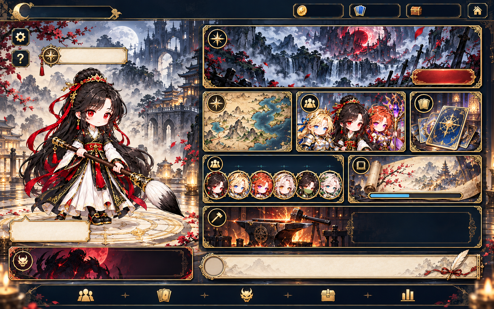
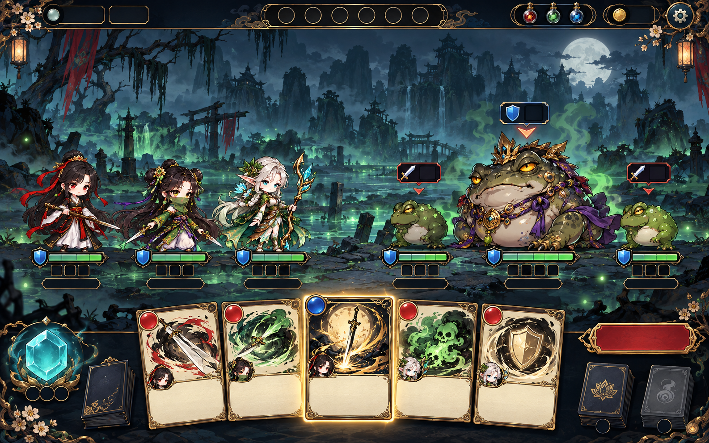
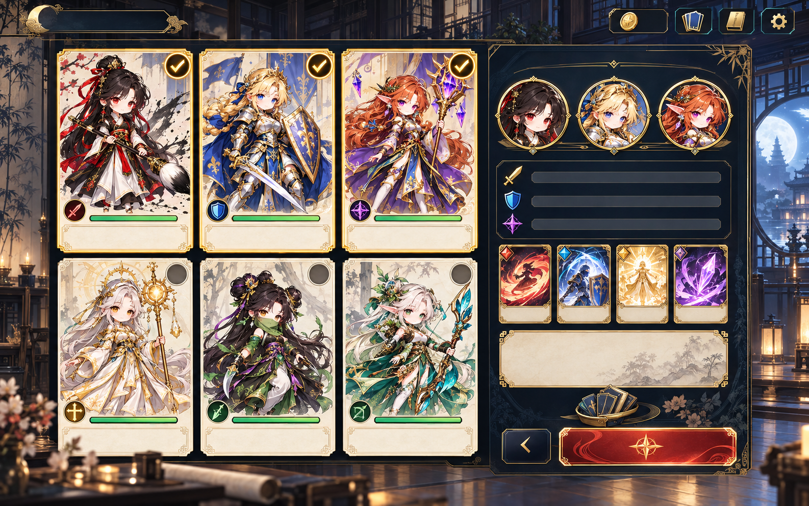
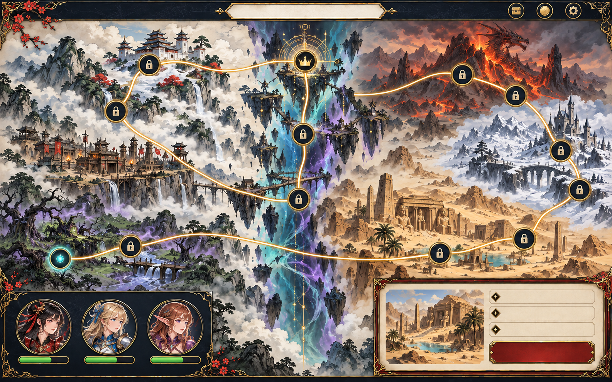

# SD 그림풍 UI/UX 전면 개편 — 첫 화면 목업

2026-10-04 · ChatGPT 디자인 제안 · 사용자 검토 전

캐릭터 화풍에 맞춰 **먹색 옻칠 패널 + 한지 정보 면 + 얇은 금박 + 청록 보석**으로 화면을 통일한다. 이번 전달은 로비·전투·편성·월드맵 4장의 시각 목업과 전 화면 개편 기준이다. 게임 코드와 승인된 캐릭터 원본은 수정하지 않는다. 전체 12개 화면의 최종 시안/개별 UI 부품 제작은 이번 방향 확인 후 이어간다.

## 전달 이미지

| 파일 | 실제 크기 | 투명 | 용도 |
|---|---|---|---|
| `assets/ui/mockups/lobby_sd_v1.png` | 1586×992 | 불투명 RGB PNG | 로비·주요 메뉴 |
| `assets/ui/mockups/battle_sd_v1.png` | 1586×992 | 불투명 RGB PNG | 전투·손패·행동 예고 |
| `assets/ui/mockups/party_sd_v1.png` | 1586×992 | 불투명 RGB PNG | 동료 선택·편성 요약 |
| `assets/ui/mockups/world_map_sd_v1.png` | 1586×992 | 불투명 RGB PNG | 두 세계 지형·진행 지점 |

요청서의 1280×800 배치를 약 1.24배로 그린 검토용 원본이다. 비율 오차는 약 0.08%로 ±3% 안이다. 전체 화면 목업이므로 배경까지 불투명이다. **게임에 직접 연결할 부품, 최종 배경, 캐릭터 파일로 사용하지 않는다.** 글자·숫자를 비워 두었으며 실제 한글은 아래 영역에 HTML로 표시한다. 이미지 안 캐릭터·몬스터·카드 그림은 배치와 분위기 참고용이다.

## 로비 — 하린과 다음 행동을 먼저 보여 주기

왼쪽 약 40%는 하린·이름·직업·레벨·대사, 오른쪽 약 56%는 이동 메뉴다. 상단의 원정/이어하기가 가장 큰 메뉴이며 진행 중인 원정이면 이어하기를 우선한다. 아래에 지도·편성·덱, 동료·스토리, 대장간을 배치한다. 하단은 도감 4종과 기록, 원정 일지다.

| 기존 정보/기능 | 새 위치 |
|---|---|
| 프로필·난이도·주차·승천 | 상단 왼쪽 빈 제목 영역 및 조건부 승천 버튼 |
| 골드·카드 수집·유물 수집·타이틀 이동 | 상단 오른쪽 |
| 설정·도움말 | 왼쪽 작은 버튼, 한글 툴팁 |
| 동료 바꾸기·직업·레벨·대사 | 하린 영역의 이름 띠·작은 전환 버튼·한지 대사 면 |
| 지도·원정/이어하기·편성·덱 | 오른쪽 상단과 둘째 줄 |
| 동료 합류 수·성장·스토리 진행·대장간 | 오른쪽 하단 메뉴 |
| 동료/카드/몬스터/유물 도감·기록 | 하단 5개 메뉴 |
| 목표 보스·동료 합류·승천 배너·원정 일지 | 하단 배너·일지 영역 |

## 전투 — 판단 정보가 캐릭터와 카드 가까이에

1280×800 기준 배치 목표는 다음과 같다. 목업의 픽셀에서 CSS 좌표를 자동 추출하지 말고 이 구조로 정돈한다.

| 영역 | 배치 목표 | 표시 내용 |
|---|---|---|
| 상단 | y=0~64 | 장소·스테이지·턴, 유물, 소모품 3칸, 골드, 되돌리기·기록·메뉴 |
| 전장 | y=80~450 | 왼쪽 동료 최대 3명, 오른쪽 적 1~4마리, 전장 중심 연계·연타 |
| 유닛 정보 | 각 유닛 가까이, 손패 시작 전 | 이름·현재/최대 체력·보호막·고유 자원·자세·상태 수치 |
| 행동 예고 | 각 적 머리 위 | 종류·피해량·연타·전체/대상, 대상 동료와 연결 표시 |
| 손패 | y=536~800 | 기본 5장, 증가 시 간격/스크롤 조정, 선택 카드 확대 |
| 좌하단 | x=24~184 | 현재/최대/다음 턴 에너지·뽑을 더미 |
| 우하단 | x=1088~1256 | 버린/소멸 더미·턴 종료 |

예고의 아래 삼각형은 목업의 시각 힌트다. 구현에서는 적이 아니라 **실제 대상 동료**를 향하는 연결선을 카드 조준선과 구별해 사용한다. 광역 공격은 전체 공격 표기와 아이콘으로 표시한다. 동료의 예상 피해는 해당 체력 근처에 둔다. 목업에 비어 있는 예고 수치와 상태 칸은 반드시 실제 데이터로 채운다.

전장 장식은 채도와 밝기를 낮춰 캐릭터·수치와 분리한다. 보스가 큰 경우 적 간격과 정보 위치를 조정해 최대 4마리가 겹치지 않게 한다. 상태가 많으면 가로 확장/툴팁으로 전체를 제공하며 임의로 버리지 않는다. 물리/마법 방어 등 기존 구분이 있는 정보는 별도 아이콘·라벨로 유지한다.

상단 조작이 목업에 모두 그려져 있지는 않다. 기존 되돌리기(Z), 전투 기록(L), 메뉴, 조건부 디버그 즉사 버튼의 접근성을 유지한다. 턴 종료(E), 카드 단축키, 클릭/드래그 대상 선택, 소모품, 더미 열기, 컷인과 빨리감기, 연계·연타 표시는 기존 동작을 유지한다. 기록은 오른쪽 접이식 패널로 열고 닫는다.

카드는 5장을 읽기 쉬운 간격으로 놓고 확대 시 전체 효과를 보여 준다. 비용·이름·종류·소유자·강화·등급·효과·조건·소멸/보존 등 기존 정보를 보존한다. 목업의 무문자 카드 면은 실제 한글 14px 이상을 기준으로 높이를 다시 맞춘다.

## 편성 — 선택과 준비 확인을 한 화면에서

왼쪽 6명을 3×2로 놓고, 오른쪽에 선택한 최대 3명의 초상·각 역할·덱 구성을 모은다. 동료 카드의 하단에는 이름·레벨·역할·직업·치명타·덱 장수·체력을 배치한다. 목업보다 그림 영역을 약간 줄여 이 정보를 넣을 수 있다. 체크·테두리·선택 인원 수로 출전을 표시한다.

잠긴 동료는 기존 합류 조건과 실루엣을 유지한다. 미선택 동료를 비활성처럼 보이게 하지 않는다. 확인 버튼은 기존 선택 조건과 문맥별 문구(확인/출발)를 따른다. 준비 덱/스테이지 덱·공용 덱·총 덱 장수 설명과 편집 접근을 유지한다.

목업 오른쪽의 검·방패·마법 세 줄은 **역할/기존 정보 배치 제안**이다. 새 공격력 합계나 승률 같은 계산 규칙을 추가하지 않는다. 한지 요약 면의 합동기 정보도 현재 데이터가 제공하는 관계만 표시하며 기존에 없는 효과를 만들어 내지 않는다.

## 월드맵 — 두 세계와 진행 상태를 지형으로 구별

무림은 왼쪽 산수·문파, 엘단은 오른쪽 사막·설원·화산, 틈은 중앙 청록·보라의 균열로 연결한다. 월드맵 13개 스테이지와 각 스테이지의 분기 방 지도는 별도 화면이다. 지점 위치·순서·해금·재도전·숨겨진 진행은 실제 `data/stages.js`와 기존 로직을 따른다. 목업의 자물쇠/초상/지형은 초기 상태의 시각 예시다.

선택한 지역의 이름·설명·테마·적/보스 정보·진행·출발/재도전을 우하단에, 편성·체력을 좌하단에 둔다. 실제 선택 가능/현재/완료/잠김 상태는 형태·아이콘·문자로 구별한다. 클릭 가능 노드는 44px 이상, 배경의 길과 구별되는 선을 쓴다. 최종 노드 위치와 노출 조건을 이미지에 굳히지 않는다.

## 나머지 화면의 개편 방향

| 화면 | 구성 방향 | 보존할 기능 |
|---|---|---|
| 타이틀 | 수묵 산수와 틈, 한지 제목, 옻칠 메뉴 | 시작·이어하기·저장 슬롯·설정 |
| 던전 지도 | 가로 분기 경로와 큼직한 방 아이콘 | 방 선택·입장·현재/미지/완료·범례·지도 이동·원정 요약 |
| 보상 | 중앙 카드 비교, 오른쪽 보상 요약 | 카드 선택/넘기기·골드·유물·소모품·남은 선택 |
| 상점 | 한지 상품 목록과 오른쪽 구매 정보 | 카드/유물/소모품·가격·골드·제거·수용 제한 |
| 휴식 | 조용한 모닥불, 동료 상태와 선택 패널 | 회복·강화 등 기존 선택과 수치·편성 |
| 대장간 | 왼쪽 카드 목록, 중앙 강화 전후, 오른쪽 비용 | 강화 단계·등급별 조건·골드·확인 |
| 도감 | 왼쪽 분류/필터, 가운데 목록, 오른쪽 상세 | 4종 도감·해금/미발견·검색/필터·성장·효과 |
| 기록 | 먹색 표와 한지 상세 패널 | 원정·승패·전투/수집 기록·기존 통계 |
| 설정 | 장식 적은 한지 목록, 큰 토글/슬라이더 | 효과음/BGM·속도·효과·색약·기존 저장 관련 기능 |

스토리·엔딩·승천·거울 모드 등 부가 화면도 공통 패널/타이포를 따르고 기존 조건부 메뉴를 유지한다. 이번 목업만으로 전체 화면 개편이 완료된 것은 아니다.

## 필요한 UI 부품 제안

| 부품 묶음 | 필요한 상태/조합 | 구현 시 유의 |
|---|---|---|
| 패널·툴팁·창 | 먹색/한지·일반/강조 | 투명 PNG 모서리/변과 CSS 표면, 글자 없는 완성 부품 |
| 버튼·탭 | 기본·호버·포커스·눌림·선택·비활성 | 44px 터치 영역, 붉은 주요 버튼과 먹색 보조 버튼 |
| 체력·방어·자원 | 빈 틀·필요한 아이콘 | 길이·수치는 CSS/HTML, 읽기 쉬운 대비 |
| 카드 틀 | 무공·마법·합동기·등급·선택 | 글자/그림 창 투명, 기존 500×700 규격 |
| 예고·지도 표식 | 공격/방어/강화/약화/특수, 방 종류와 잠김/완료 | 아이콘은 128px 투명, 소켓과 별도 |
| 에너지·더미·메뉴 | 보석·뽑기/버림/소멸·메뉴 아이콘 | 소켓·광채는 절제, 상태 숫자는 이미지에 없음 |
| 제목·구분선·진행바 | 무림/엘단/틈의 모서리 장식 | 같은 패널에 과도한 장식 중첩 금지 |

부품의 실제 크기·분할 규칙은 사용자 승인 후 Claude가 확정한다. 완성 PNG를 코드로 자르거나 재채색하지 않는다. PNG는 직접 표시하고 바/텍스트/배치는 CSS/HTML로 구현한다. 게임은 `file://`로 계속 실행되어야 한다.

## 다음 검토와 구현 순서

1. 사용자가 4장으로 재질·색·장식 밀도·정보 구조를 검토한다.
2. 승인된 방향으로 한글과 실제 수치를 얹은 1280×800 상세 시안, 긴 카드 효과/상태 다수/적 4마리/다량 손패 사례를 확정한다.
3. 나머지 화면 시안과 필요 부품을 완성한다. 모바일에서는 카드·지도·동료 선택을 스크롤/상세 보기로 읽을 수 있게 하며 원본 화면 전체를 작게 축소하는 방식에 의존하지 않는다.
4. Claude가 기존 기능을 보존해 연결하고 오프라인·해상도·키보드·대비·리소스를 확인한다.

검토 기준: 새 SD 캐릭터와 UI의 화풍 일치, 이름/수치 공간, 본문 대비, 금테의 과장, 선택과 경고의 구별, 기존 기능 접근. 캐릭터 원본 수정이나 새 전투 규칙은 이번 제안에 포함하지 않는다.

## 검증과 Claude 인계

- PNG 4장의 디코딩·RGB 모드·1586×992 크기·8:5 비율 허용 범위를 확인했다. 수정된 월드맵의 큰 지점은 무림 4 + 엘단 6 + 틈 3 = 13개로 눈으로 확인했다.
- 모든 그림에 이름·숫자를 넣지 않았고, 기존 캐릭터 원본/게임 코드/리소스 목록은 변경하지 않았다. 글자와 실제 수치가 들어간 상태의 가독성·대비·모바일 검증은 상세 시안 및 Claude 연결 단계에 남아 있다.
- **기존 검사 도구에는 목업 구분이 없다.** `node tools/sync-assets.js --check`는 `ui/mockups/*.png`를 투명 UI 부품으로 판단하므로 투명 조건 오류 4개와 목록 불일치 1개, 총 5개 오류를 낸다. 전체 화면 목업은 요청서 3-1의 지정 위치에 둔 불투명 검토 자료다. 최종 UI 부품의 투명 규칙을 완화하지 말고, Claude가 목업 폴더를 런타임 스캔 대상에서 제외하거나 목업 전용 분류를 추가한 뒤 목록을 검사하면 된다.
- 이번 결과물은 디자인 검토 단계다. 사용자 확인 전 게임 UI에 적용하거나 최종 부품으로 등록하지 않는다.
